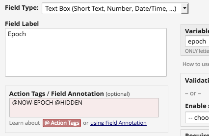

# REDCap Epoch Action Tag
Provides a new action tag - `@NOW-EPOCH` - which writes the current [Epoch](https://en.wikipedia.org/wiki/Unix_time) time (aka Unix time) into a field.

This action tag works similarly to `@NOW`, but instead of returning a string, `@NOW-EPOCH` returns an integer, which can be used to set calculated fields or branching logic.

## Prerequisites
- REDCap >= 8.0.3

## Easy Installation
- Obtain this module from the Consortium [REDCap Repo](https://redcap.vanderbilt.edu/consortium/modules/index.php) from the Control Center.

## Manual Installation
- Clone this repo into `<redcap-root>/modules/epoch_action_tag_v<version_number>` .
- Go to **Control Center > Manage External Modules** and enable Epoch Action Tag.

## How to use it
Once the module is enabled on a project, go to Online Designer and create a text field. Then, add `@NOW-EPOCH` action tag to it.

And that's it! The current Epoch is set to your field as the default value. You may also combine `@NOW-EPOCH` with other action tags like `@READONLY` or `@HIDDEN` in order to best suit your purposes.

## Useful links
- [Unix time - Wikipedia](https://en.wikipedia.org/wiki/Unix_time)
- [Epoch Converter](http://epochconverter.com/)
